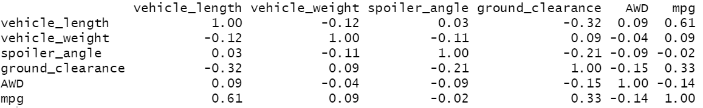
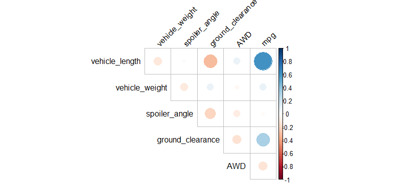
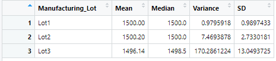

# MechaCar Statistical Analysis
  <b> Hypothesis - Following independent variables has a significant impact on the mileage. </b>  
  <b> H0 : The slope of the linear model is zero, or m = 0  </b>  
  <b> Ha : The slope of the linear model is not zero, or m ≠ 0 </b>  
 
## Linear Regression to Predict MPG Analysis
We'll look at each independent variable to determine if there is a significant relationship with the dependent variable.
 #### Which variables/coefficients provided a non-random amount of variance to the mpg values in the dataset?
 
 According to the result (see below table and graph), vehicle length and ground clearance are statistically unlikely to provide random amounts of variance to the linear model. However, the multiple linear regression model outperformed the simple linear regression. 
 According to the summary output (see below), the r-squared value shows 0.72 in our multiple linear regression model while the p-value remained significant. 

		
#### Data between Dependent and Independent variables  
   
#### Graph Visualizing the Correlation between Dependent and Independent variables  
   
 
 #### Is the slope of the linear model considered to be zero? Why or why not?
 
 The slope of our linear model is not zero, because the p-value of our linear regression analysis is 5.35e-11 which is much smaller than our assumed significance level of 0.05%. 

 
 #### Does this linear model predict the mpg of MechaCar prototypes effectively? Why or why not?
 
  From the linear regression model, the r-squared value is 0.72, which means that roughly 72% of the variability of our dependent variable is explained using this linear model. In addition, the p-value of our linear regression analysis is 5.35e-11, which is much smaller than our assumed significance level of 0.05%. 
Therefore, we can state that there is sufficient evidence to reject our null hypothesis, which means that the slope of our linear model is not zero. 

	
	
## Summary Statistics on Suspension Coils
 
 Current Manufacturing data do indeed meet the design specification for all manufacturing costs in total and each lot individually. Looking at the table below, the standard deviation over mean is very low, which indicates that the suspension coils are close to the mean, and very small variation.  

 
#### Total Summary  
   
#### Lot Summary  
   

## T-Test against the population mean 1500
- All against the population mean 1500 generated p-value of 2.2e-16.  
- The true mean is between 1497.507 and 1500.053 and the mean of x is 1498.78, which sits right around mean values.
- Therefore we cannot reject the null hypothesis.  There is not enough evidence to prove it to be rejected.

- Lot1, Lot2, Lot3 against the population mean 1500 generated p-value of 2.2e-16.  
- All of them generated a p-value < 2.2e-16 and 95 percent confidence intervals of approximately between 1946 (lowest lot3) and 1500.977 (highest lot2)
- Therefore we cannot reject the null hypothesis.  There is not enough evidence to prove it to be rejected.

## Study Design: MechaCar vs Competition (Sample)
	The basic idea behind a Sample T-Test is to use statistics to evaluate two contrary hypotheses:
	The One-Sample t-test, or student's test, compares the mean of a vector against a theoretical mean.
	
	H0: Null hypothesis: The average is the same as the sample used.
	Ha: True hypothesis: The average is different from the sample used.
	
- To create a randomized vector, a function called rnorm() is used.
- Mean and standard deviation of MechaCar are used.	
- 30 observations were assigned.
	
 <b> A t-test looks at the t-statistic, and the t-distribution values to determine the statistical significance.  Below is the test result: </b>
	
#### Single sample T-Test Result:
   
 95 percent confidence interval:  1499.069 1504.015, t = 1241.7, df = 29, p-value < 2.2e-16  mean of 1502.542 

	
- Paired T-Test :
	The Paired T-test, or dependent sample t-test, is used when the mean of the treated group is computed twice.
	H0: No difference in mean.
	H3: The two means are different.
	
- To create a randomized vector, a function call rnorm() is used.
- Mean of MechaCar + 100 / - 100 is used and the same standard deviation is used.	
- Each sample - 30 observations were assigned.
	
<b> Paired T-Test Result: </b>  

 95 percent confidence interval: -203.1115 -195.5869, p-value < 2.2e-16,  mean of x mean of y 1399.453  1598.802 
 

 With p-value of  2.2e-16, we can conclude the averages of the two groups are significantly different. 

